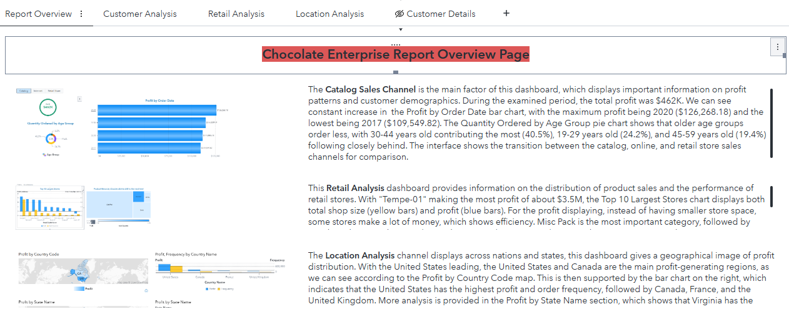
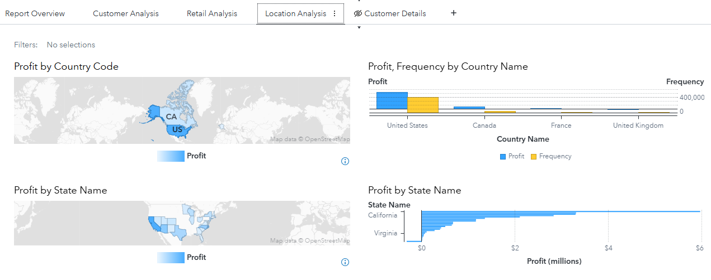

# Chocolate Enterprise Report — SAS Business Intelligence

A **business-intelligence report** for a chocolate enterprise, built with the
**SAS BI** toolset — analysing sales and operational performance and presenting
the findings as an executive-ready report.

## Deliverable

| File | Description |
|---|---|
| `Chocolate Enterprise Report using SAS Business Intelligence tool.pdf` | The full BI report — visualisations, KPIs, and insights |

## What it covers

- Sales and performance analysis across products / regions for the enterprise.
- KPI dashboards and visual reporting produced in SAS BI.
- Insights and recommendations framed for business stakeholders.

## Dashboards

**Report Overview** — a landing page summarising the Catalog Sales, Retail, and
Location analyses (total profit ≈ $462K over the period).

**Location Analysis** — geographic profit distribution: the United States and
Canada are the main profit-generating regions, broken down to state level
(California leading).

> Screenshots are from the full SAS BI report PDF in this repo.

## Tool

**SAS Business Intelligence** (reporting & visual analytics).

> The repository hosts the final PDF report. Open it to view the full analysis.
